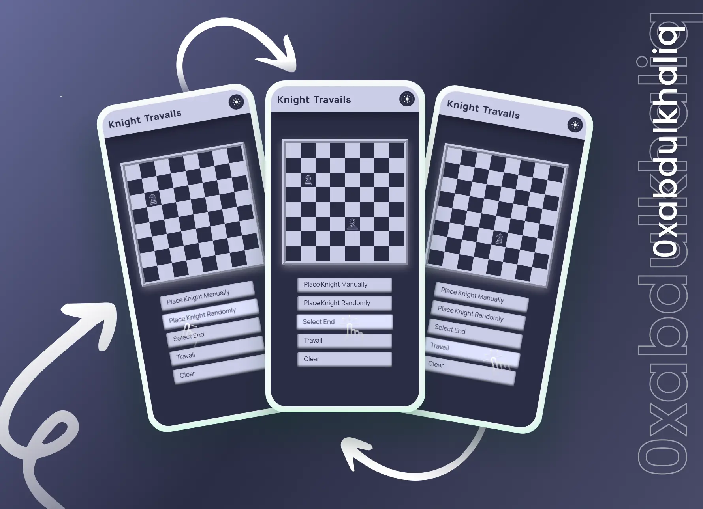

<br>
<div align="center">
<picture>
    <source media="(prefers-color-scheme: light)" srcset="https://readme-typing-svg.herokuapp.com?font=Space+Grotesk&weight=600&size=40&pause=&color=000&center=true&vCenter=true&repeat=false&random=false&width=280&height=60&lines=Knight+Travails">
    
  </picture>
<br>

**❝** Find the optimal path for your Knight's journey. **❞**

<br>
  <p>
    ❯ &nbsp;
    <a href="https://knight-travails.vercel.app/">View Demo</a>
    &nbsp;·&nbsp;
    <a href="https://github.com/0xabdulkhalid/knight-travails/issues">Report Bug</a>
    &nbsp;·&nbsp;
    <a href="https://github.com/0xabdulkhalid/knight-travails/issues">Request Feature</a>
     &nbsp; ❮
  </p>
</div>

<br>

<div align='center'>

</div>

<br>

## Installation

> [!NOTE]  
> If you prefer not to install it locally, you can also access the [live demo](https://knight-travails.vercel.app/) version

To set up the Knight Travails Application locally, follow these steps:

1. Clone the GitHub repository to your local machine:

   ```bash
   git clone https://github.com/0xabdulkhalid/knight-travails.git
   ```

2. Navigate to the project's directory:

   ```bash
   cd knight-travails
   ```

3. Install the project's dependencies using npm:

   ```bash
   npm install
   ```

4. Build the project to bundle JavaScript, minify HTML and CSS, and move images:

   ```bash
   npm run build
   ```

5. The build files can be found on `dist` (distribution) directory.

<br>

## Features

- **Graph Theory:** The project's core algorithm is rooted in graph theory, leveraging graphs to represent and solve the knight's traversal problem.

- **BFS Algorithm:** The BFS (Breadth-First Search) algorithm is utilized to find the optimal path for the knight's journey.

- **Adjacency List:** An adjacency list data structure is employed to efficiently represent graph connections, facilitating the pathfinding process.

- **Manual Knight Placement:** Users can manually position the knight on the chessboard, setting the starting point for the traversal.

- **Random Knight Placement:** For added intrigue, the project provides the option to randomly place the knight on the chessboard.

- **Select End Point:** Users can designate the destination point for the knight's journey, initiating a search for the best path.

- **Animated Travail**: Experience the smooth and realistic knight movement as it traverses the chessboard in a true L-shape, making the knight's journey a visually captivating experience.

- **Clear Functionality:** Users can effortlessly clear the chessboard, resetting the knight's position and path, enabling fresh exploration of scenarios.

- **Seamless Theme Switching**: Enjoy a light or dark theme at your convenience, and your preferred theme is automatically saved in local storage for a consistent experience across visits.

- **ES6 Modules**: JavaScript code is organized into ES6 modules for improved maintainability.

- **Webpack Bundling**: Optimize resource loading by bundling JavaScript modules with Webpack.

- **Optimized for Any Screen**: Effortlessly adapt to screens of all sizes, ensuring a flawless experience on both desktop and mobile devices.

- **Cross-Browser Compatibility**: Ensure smooth performance across various web browsers.

- **Code Formatting Guidelines**: The project adheres to coding standards and maintains code consistency by implementing ESLint along with Prettier for code formatting.

<br>

## Pagespeed Insights Score
  
- ||
  | :-----: |
  |  <b>Overall Score 99.4%, Average of Mobile and Desktop</b><br>[ Mobile devices score is only shown below ] |
  | |
  |  |
  | |
  | Check out [**Pagespeed Insights**](https://pagespeed.web.dev/analysis/https-knight-travails-vercel-app/zkarwfm4q3?form_factor=mobile) to get live score |
  ||

<br>

## Built With

<div align=center>

 &nbsp;&nbsp; &nbsp;&nbsp; &nbsp;&nbsp; &nbsp;&nbsp; &nbsp;&nbsp;

</div>

<br>

## Tools Used

<div align=center>
  
 &nbsp;&nbsp; &nbsp;&nbsp; &nbsp;&nbsp; &nbsp;&nbsp; &nbsp;&nbsp; &nbsp;&nbsp;

</div>

<br>

## Let's Connect 👋

<div align=center>

  <a href="https://linkedin.com/in/0xabdulkhalid" >
    
  </a>&nbsp;&nbsp;

  <a href="mailto:0xabdulkhalid@gmail.com" target="_blank">
    
  </a>&nbsp;&nbsp;

  <a href="https://www.github.com/0xabdulkhalid/" >
    
  </a>

</div>

<br>
